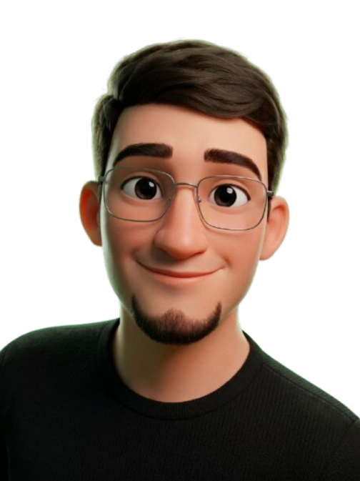

<!--made with  <3 by @dudxzn1 -->

  <a href="#">
    
    <!-- 
    🇧🇷: Outras variantes de cores // só substituir 
        
        
        
    !-->
  </a>

<!-- 🇧🇷: Nome + Descrição

 

 !-->

 <!-- 🇧🇷: Frase ou Seu nome 
 

 !-->

<!-- 🇧🇷:  FOTO CARTOON 2D --> 

  

 

  
  

  

### 🌐 Socials: 

  
  
  
  
  

### ⚒️ Languages and Tools:

  
     

<!--Profile Viewers-->

  

  
<!--Thanks For Visiting :) -->

  

<!-- 🇧🇷: Frase ou Seu nome

 

-->

  <a href="https://github.com/dudxz7">
    
    <!-- 
        🇧🇷: Outras variantes de cores // só substituir
          
          
           
    -->
  </a>

